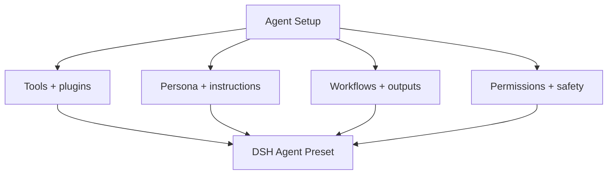
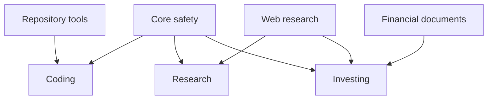
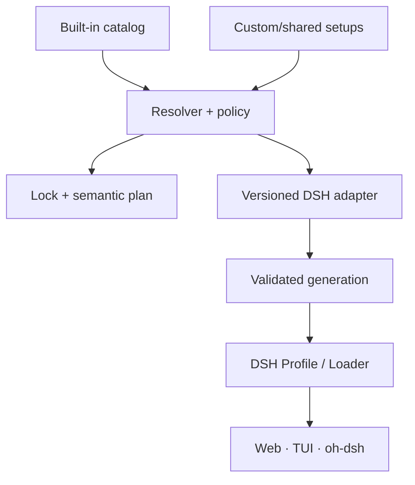

# oh-my-dsh Product and Technical Specification

**Status:** revised proposal  
**Decision date:** 2026-08-13  
**Target baseline:** DSH `0.1.0-rc.5/rc.6`; oh-dsh `0.1.1`  
**Team assumption:** 1–3 volunteer maintainers  
**Evidence convention:** **[UNVERIFIED]** marks an interface or behavior not established by the inspected repository documentation.

This revision makes the product thesis explicit: **oh-my-dsh wins through opinionated built-in agent setups, not through another shell or a generic configuration compiler.** Portability, locking, migration, and rollback support that experience; they are not the hero feature.

The proposal is grounded in the current [DeepSeek Harness README](https://github.com/deepseek-ai/deepseek-harness/blob/master/README.md), [DSH configuration catalog](https://github.com/deepseek-ai/deepseek-harness/blob/master/docs/config-catalog.md), [DSH third-party notices](https://github.com/deepseek-ai/deepseek-harness/blob/master/THIRD_PARTY_NOTICES.md), [oh-dsh README](https://github.com/hust-open-atom-club/oh-dsh/blob/main/README.md), and [oh-dsh third-party notices](https://github.com/hust-open-atom-club/oh-dsh/blob/main/THIRD_PARTY_NOTICES.md).

## 1. Executive decision

Choose **B: a config/extension framework above DSH front-ends**, expressed to users as a curated collection of agent setups.

oh-dsh already owns the desktop distribution layer: Electron shell, terminal, Files, browser, Git review, plugin marketplace, skins, and desktop lifecycle. DSH already supplies Cordis plugins, user Agent Presets, providers, sessions, and runtime primitives. Rebuilding either layer would be duplicative and unaffordable.

The actual gap is:

> DSH provides mechanisms, but a user still needs to decide which instructions, tools, plugins, workflows, permissions, and output conventions belong together for a particular kind of work.

oh-my-dsh supplies that missing product judgment. It ships a small set of coherent built-in vertical presets, makes them selectable in seconds, and provides a portable format for saving, modifying, exporting, and sharing an agent setup.

### Falsifiable bet

The project succeeds only if all three are true in a 20-user pilot:

1. At least 12 users repeatedly use two or more vertical presets.
2. At least 6 users save, fork, export, or import a setup.
3. Median time from “I need a research/coding/investing agent” to a ready new session is under five seconds after initial installation.

If users mainly stay in one preset, do not share setups, or prefer raw DSH configuration, the “oh-my-zsh for DSH” analogy is false. The useful resolver should then be upstreamed as a narrow utility.

## 2. Product promise

### Tagline

> **Curated agents for real work. Switch in seconds. Make them yours. Share them anywhere.**

### README pitch

> **oh-my-dsh is the opinionated preset layer for DeepSeek Harness.** Install a curated set of Coding, Research, and Investing agents, then choose the right setup when starting a session. Each setup brings a coherent persona, instructions, tools, plugins, workflows, permissions, and output conventions. Fork a built-in, save your changes, export it as one portable artifact, or share a pinned Git source. oh-my-dsh uses DSH’s own Profile, Loader, Agent Preset, settings, locale, and client contracts; it does not replace the runtime, model providers, or oh-dsh Desktop.

### Value hierarchy

1. **Built-in taste:** useful defaults selected and maintained by people with a point of view.
2. **Fast switching:** choose a vertical for each new session without editing YAML or reinstalling plugins.
3. **Ownership:** fork and customize a built-in without losing its update lineage.
4. **Sharing:** export/import one setup without secrets or machine-specific paths.
5. **Trust and durability:** pin, inspect, validate, migrate, and roll back configurations.

The first two are the product. The last three make the product sustainable.

## 3. Terminology and conceptual model

User-facing terminology must hide DSH composition jargon unless troubleshooting requires it.

| Term | Meaning | User-facing? |
|---|---|---:|
| **Agent Setup** | A portable definition of one agent working environment: persona, instructions, tools, plugins, workflows, permissions, and output conventions. | Yes |
| **Built-in Setup** | A first-party, curated Agent Setup shipped and tested by oh-my-dsh. | Yes |
| **Custom Setup** | A user-owned fork or newly created Agent Setup. | Yes |
| **Capability Pack** | A reusable internal building block such as `web-research`, `repository-tools`, or `financial-documents`. | Advanced |
| **Agent Preset** | The DSH-native per-session composition generated from an Agent Setup. | Only when mapping to DSH UI |
| **Host Profile** | DSH/oh-dsh host-level plugin composition. | No |
| **Generation** | One validated, immutable materialization of the installed setup catalog. | Troubleshooting |

The central object is an **Agent Setup**, not a theme and not an entire DSH installation.



## 4. Product principles

### 4.1 Taste over abundance

The official catalog launches with exactly three built-ins: Coding, Research, and Investing. A fourth is not added until it has a distinct job, maintainer, task corpus, and reason it cannot be a documented variant.

A built-in is accepted only when:

- It has one clear job-to-be-done.
- Every exposed tool is used by at least one reference workflow.
- Competing tools are not included “just in case.”
- Default permissions match the least authority required by its job.
- Output conventions are concrete enough to change behavior.
- It passes scenario tests on every supported DSH release line.
- The README explains why each capability is present and what was deliberately excluded.

Themes, icons, and names may make the catalog pleasant, but are cosmetic. They cannot substitute for workflow quality.

### 4.2 Switching means starting a correctly scoped session

DSH records an Agent Preset with a session. Therefore v0.1 does not mutate the preset under an active session. “Switch” means:

- choose a setup when creating a new session; or
- change the default for future sessions.

An in-place switch would create ambiguous history and permissions. A v0.2 “Continue as…” action may create a new session with a bounded handoff from the old one; it must not rewrite the old session.

### 4.3 Install capabilities once; expose them per setup

Switching cannot trigger plugin downloads or restarts. The host installs the vetted union of host-level plugins required by enabled setups. Each per-session Agent Preset exposes only the relevant tools and workflows.

This is capability selection, not process isolation. A host-level plugin may remain loaded even when a preset does not expose its tools. oh-my-dsh must never imply otherwise.

### 4.4 User setups are first-class, not detached copies

Forking a built-in records its origin and version. A later update can show upstream changes without overwriting user edits. The user owns the custom setup and may detach it from upstream at any time.

### 4.5 Sharing is local-first

v0.1 supports a single portable archive and a pinned Git source. It does not require accounts, a hosted registry, or a cloud service. “Share” means produce an artifact another person can inspect and import; it does not mean silently upload configuration.

## 5. Built-in vertical setups

### 5.1 Coding

**Job:** inspect, modify, test, and review a software repository with bounded autonomy.

| Layer | Curated default |
|---|---|
| Persona | Senior software engineer: inspect first, state plan, make bounded changes, verify externally. |
| Context | `AGENTS.md`, repository instructions, relevant code and tests; no broad home-directory context. |
| Tools | Workspace filesystem, code search, patch/edit, Bash or PowerShell, Git status/diff, test runner. |
| Plugins | DSH-native filesystem/shell/tooling plus host review integration when present. |
| Workflows | `understand-repo`, `plan-implement-test`, `review-current-diff`, `diagnose-without-fixing`. |
| Permissions | Workspace write; network asks; destructive commands deny; secrets unavailable by default. |
| Output | Plan, changed files, tests run, unresolved risks. |
| Excludes | Browser automation, broad web research, deployment credentials, automatic commit/push. |

Reference tasks:

1. Add a bounded feature and tests.
2. Diagnose a failing integration test without editing.
3. Review the current diff and leave actionable findings.
4. Refactor while proving behavior is unchanged.

### 5.2 Research

**Job:** produce a source-grounded answer with explicit evidence quality and uncertainty.

| Layer | Curated default |
|---|---|
| Persona | Evidence-driven researcher: prefer primary sources, separate fact from inference, seek disconfirmation. |
| Context | User-provided files and project research notes; local filesystem read-only by default. |
| Tools | Web search/fetch, browser, PDF reader, structured extraction, citation capture. |
| Plugins | DSH Web tools and citation/evidence-table contributions; no code execution unless explicitly enabled. |
| Workflows | `scope-question`, `source-discovery`, `evidence-table`, `claim-verification`, `synthesis`. |
| Permissions | Network allowed; local read-only; shell disabled; no outbound publication. |
| Output | Executive answer, evidence table, disagreements, confidence, open questions, citations. |
| Excludes | Repository mutation, generic terminal, unsupported precise claims, source-free prose. |

Reference tasks:

1. Compare two technical approaches using primary sources.
2. Research a company/product and identify unresolved claims.
3. Read several PDFs and build a claim-evidence matrix.
4. Fact-check a draft and mark unsupported statements.

### 5.3 Investing

**Job:** analyze a company or thesis with financial evidence, scenarios, risks, and disconfirming signals.

| Layer | Curated default |
|---|---|
| Persona | Skeptical investment analyst: distinguish narrative, evidence, assumptions, and price-sensitive conclusions. |
| Context | User research notes, filings, earnings materials, and watchlist metadata. |
| Tools | Web research, filings/PDFs, market-data read APIs, spreadsheet/table analysis, calculator. |
| Plugins | `web-research`, `financial-documents`, optional market-data reader. |
| Workflows | `company-deep-dive`, `earnings-review`, `thesis-update`, `valuation-scenarios`, `risk-register`. |
| Permissions | Read-only data access; network allowed; brokerage and trade execution denied. |
| Output | Thesis, evidence, catalysts, valuation assumptions, bull/base/bear cases, risks, disconfirming evidence. |
| Excludes | Order placement, portfolio rebalancing, personalized financial instructions, unsupported real-time data claims. |

Reference tasks:

1. Analyze a public company from filings and earnings calls.
2. Update a thesis after quarterly results.
3. Compare competitors and identify moat durability.
4. Produce a valuation sensitivity table with explicit assumptions.

Investing research and trade execution remain separate. The official v0.1 setup has no broker-write capability.

## 6. Capability composition

Built-ins share reviewed capability packs instead of duplicating configuration:



Initial capability packs:

| Capability pack | Consumers | Contents |
|---|---|---|
| `core-safety` | All | Telemetry off, secret references only, permission defaults, output disclosure. |
| `repository-tools` | Coding | Filesystem, code search, editor, shell, Git, test workflow. |
| `web-research` | Research, Investing | Search/fetch/browser, citation capture, evidence workflow. |
| `document-analysis` | Research, Investing | PDF/text extraction, tables, page citations. |
| `financial-documents` | Investing | Filing conventions, financial tables, thesis and valuation workflows. |

Composition is strict:

- Dependency cycles fail.
- Duplicate tool or workflow IDs fail unless the setup explicitly overrides one.
- Permissions combine by **most restrictive wins** unless the root setup explicitly requests and explains an elevation.
- Setup-local persona and output conventions override capability defaults.
- Secrets never inherit through a capability pack.

## 7. Key user journeys

### 7.1 Install and use built-ins

```bash
pnpm dlx oh-my-dsh init
```

Expected output:

```text
Installed built-in agent setups:

  coding      Build, debug, test, and review software
  research    Conduct cited, evidence-driven research
  investing   Analyze companies, filings, and investment theses

Default: coding
Open a new DSH session and choose an Agent Setup.
```

In a compatible DSH front-end:

```text
New Session
Workspace:    ~/projects/example
Agent Setup:  Coding ▾

              Coding
              Research
              Investing
              My Setups…
```

Acceptance criterion: after initial installation, a user starts a session with any built-in in no more than two interactions and five seconds, with no plugin install and no host restart.

**[UNVERIFIED]** DSH exposes an Agent Preset picker, but a stable third-party contract for relabeling or enriching its rows with descriptions has not been established. The guaranteed fallback is to install clearly named DSH Agent Presets; custom picker UI is adapter-dependent.

### 7.2 Change the default

```bash
oh-my-dsh use research --default
```

```text
Default Agent Setup changed:
  coding → research

Existing sessions were not modified.
```

### 7.3 Fork a built-in and customize it

```bash
oh-my-dsh agent fork investing --as my-long-term-investing
```

```text
Created My Setups / Long-Term Investing
Based on: builtin/investing@0.1.0

Editable file:
  ~/.dsh/oh-my-dsh/agents/my-long-term-investing/agent.yaml
```

The generated setup is intentionally small:

```yaml
apiVersion: omdsh.dev/v1alpha1
kind: AgentSetup

metadata:
  id: local.my-long-term-investing
  name: Long-Term Investing
  version: 0.1.0

extends:
  id: builtin.investing
  version: 0.1.0

overrides:
  instructions:
    append:
      - Focus on five-year business quality and reinvestment runway.
      - Always include a reverse-DCF expectation check.
  workflows:
    enable:
      - management-quality
      - capital-allocation-review
  permissions:
    brokerage: deny
```

`oh-my-dsh plan` shows only the delta from the built-in. Updating the built-in never silently rewrites this file.

### 7.4 Save a setup

There are two distinct save operations:

1. **Fork/save definition:** persist a modified Agent Setup.
2. **Save session state:** DSH owns conversation/session persistence and is out of scope.

v0.1 saves definitions, not conversations:

```bash
oh-my-dsh agent save my-long-term-investing
```

```text
✓ Schema valid
✓ No embedded credentials
✓ No absolute machine paths
✓ Compatible with DSH 0.1.0-rc.5/rc.6
✓ Saved Agent Setup local.my-long-term-investing@0.1.0
```

A future front-end action may expose “Duplicate setup” and “Save setup.” **[UNVERIFIED]** this depends on stable DSH client contribution slots. CLI behavior is the compatibility floor.

### 7.5 Export and share

```bash
oh-my-dsh agent export my-long-term-investing
```

```text
Created:
  my-long-term-investing-0.1.0.omdsh-agent

Contains:
  agent.yaml
  workflows/
  instructions/
  omdsh.lock
  README.md
  LICENSE
  checksums.json

Excluded:
  credentials
  session history
  API keys
  absolute workspace paths
  local caches
```

The user can attach that single file to an issue, release, message, or email. oh-my-dsh does not upload it.

The recipient runs:

```bash
oh-my-dsh agent import my-long-term-investing-0.1.0.omdsh-agent
```

Before import:

```text
Agent Setup: Long-Term Investing 0.1.0
Publisher:   unverified local export
Based on:    builtin.investing@0.1.0

Adds:
  + 2 instruction fragments
  + 2 workflows

Uses installed capabilities:
  = web-research
  = financial-documents

Permissions:
  network       allow
  local files   read-only
  brokerage     deny

No plugin code has been executed.

Import? [y/N]
```

Acceptance criterion: exporting on one OS and importing on another produces the same normalized setup hash, excluding host path bindings.

### 7.6 Share through Git

Advanced users may publish an Agent Setup directory:

```bash
oh-my-dsh agent add \
  github:hongyu/dsh-agent-setups/long-term-investing \
  --rev 8d24a210c810c3d48f633fb33e6092286a71cb21
```

Branches and tags may be used for discovery, but the installed lock resolves to a full commit and content digest. Updates require a new plan and explicit apply.

### 7.7 Update and reconcile a fork

```bash
oh-my-dsh update
```

```text
Built-in update available:
  investing 0.1.0 → 0.2.0

Your fork: my-long-term-investing

Upstream changes:
  + Adds filing-source verification workflow
  ~ Tightens market-data permission to read-only
  - Removes redundant generic calculator plugin

Your overrides:
  = Compatible; no conflict

Run:
  oh-my-dsh update --apply
```

Conflicts stop the update. There is no automatic “last writer wins.”

## 8. Agent Setup format

### 8.1 Manifest

```yaml
apiVersion: omdsh.dev/v1alpha1
kind: AgentSetup

metadata:
  id: dev.oh-my-dsh.research
  name: Research
  version: 0.1.0
  description: Source-grounded research with citations and uncertainty.
  license: MIT

compatibility:
  dsh: ">=0.1.0-rc.5 <0.2.0"
  adapters: [dsh-rc5]

capabilities:
  - id: dev.oh-my-dsh.core-safety
    version: 0.1.0
  - id: dev.oh-my-dsh.web-research
    version: 0.1.0
  - id: dev.oh-my-dsh.document-analysis
    version: 0.1.0

persona:
  file: instructions/persona.md

instructions:
  files:
    - instructions/research-method.md
    - instructions/citation-policy.md

workflows:
  - workflows/deep-research.yaml
  - workflows/fact-check.yaml

tools:
  allow:
    - web.search
    - web.fetch
    - browser.read
    - document.read
  deny:
    - shell.execute
    - filesystem.write

permissions:
  network: allow
  filesystem: read-only
  dataExport: deny

output:
  conventions:
    - Cite each material factual claim.
    - Separate source fact from inference.
    - End with uncertainty and open questions.

examples:
  - examples/compare-technologies.md
  - examples/company-research.md
```

### 8.2 Schema rules

- IDs are reverse-DNS; built-ins use `dev.oh-my-dsh.*`; local forks use `local.*` until published.
- Versions are SemVer.
- Files are relative, normalized, confined to the setup root, and checked for case collisions.
- No JavaScript expressions, shell lifecycle hooks, inline secrets, credential values, or absolute paths.
- Tool and workflow references resolve to exact capability versions in the lockfile.
- Host-specific contributions are explicitly optional and may not change the setup's semantic core.
- Unknown fields fail in v0.1. Silent ignore makes sharing unsafe.

### 8.3 Lockfile

`omdsh.lock` records:

- Agent Setup and capability versions.
- Canonical source identities and full revisions.
- npm integrity or content digest for each plugin artifact.
- Dependency graph.
- Declared licenses and provenance status.
- Adapter version and DSH compatibility range.
- Normalized setup hash.

It excludes credentials, session logs, absolute workspace paths, user prompts, and machine-specific target paths.

## 9. Resolution and precedence

Precedence is low to high:

1. DSH/host base composition, never rewritten.
2. `core-safety` and dependency capability packs, topologically sorted.
3. Built-in Agent Setup.
4. Published parent setup, if the setup extends one.
5. User fork overrides.
6. Project-local bindings that are explicitly declared project-overridable.
7. Session choice of setup; this selects a composition but does not mutate its definition.

Rules:

- Duplicate IDs fail unless an explicit `replaces` declaration names the loser.
- Permission conflicts choose the most restrictive value unless the final setup explicitly elevates and the plan highlights it.
- A custom setup may append or replace instructions, but replacements appear in the plan.
- Native user DSH configuration remains authoritative outside the oh-my-dsh-managed subtree.
- Environment variables may bind credential references and target locations; they do not alter semantic setup content.

## 10. Switching architecture

### 10.1 Fast path

At installation/update time:

1. Resolve enabled Agent Setups.
2. Compute the union of required host-level plugins.
3. Install and validate that union once.
4. Generate one DSH-native Agent Preset per Agent Setup.
5. Publish the preset catalog atomically.

At session creation time:

1. User chooses Coding, Research, Investing, or a custom setup.
2. DSH mounts the corresponding Agent Preset.
3. The preset exposes its tool/workflow subset and records its identity with the session.

No network resolution, package install, or host restart occurs in the session-creation path.

### 10.2 Existing sessions

Existing sessions keep their original setup. Updating or deleting a setup affects only future sessions; retained session metadata must still show the original setup ID/version.

v0.2 may add:

```text
Continue as… Research
```

This creates a new session with:

- an explicit bounded handoff summary;
- selected user attachments/references;
- the new setup's permissions and workflows;
- a link back to the source session.

It does not copy hidden credentials, tool state, or the entire context implicitly. **[UNVERIFIED]** this requires a stable DSH session-fork/seed client contract.

## 11. Architecture



### 11.1 TypeScript + pnpm workspace

- `packages/schema`: Agent Setup, Capability Pack, lockfile, and export schemas.
- `packages/catalog`: first-party built-ins and capability packs.
- `packages/core`: resolution, inheritance, policy, canonicalization, semantic diff, export/import.
- `packages/adapter-dsh-rc5`: DSH paths, preset compilation, validation integration.
- `packages/cli`: `init`, `list`, `use`, `agent fork/save/export/import/add`, `plan`, `apply`, `update`, `rollback`, `doctor`.
- `packages/client-contrib`: optional preset-picker descriptions/actions where stable host contracts exist.
- `scenarios/`: reference tasks and normalized expected capability/output assertions.

No deviation from TypeScript/pnpm is justified. No native dependency is required. Archives, YAML, hashing, and atomic files use Node/pure JavaScript. A feature that requires a native dependency must have a host-delegated or pure-JS fallback.

### 11.2 DSH integration

The one-time bootstrap adds one namespaced Cordis Include entry to the user's DSH patch, pointing to a stable managed file. oh-my-dsh materializes Agent Presets into DSH's user preset root using namespaced IDs.

v0.1 managed plugin entries are additive. They do not patch or replace arbitrary host/base rows; Cordis patch scope across Include boundaries is subtle, and reproducing it would create permanent RC maintenance.

An apply transaction:

1. Resolve sources without importing plugin modules or running install scripts.
2. Create a complete immutable generation.
3. Validate schema, paths, compatibility, permissions, provenance, and normalized DSH composition.
4. Atomically replace stable managed files without symlinks.
5. Retain prior generations and record the active one.

If the user's patch cannot be edited without changing unrelated nodes, bootstrap stops and prints the exact manual insertion. It does not reserialize the file destructively.

### 11.3 Forked, vendored, and new

| Treatment | Decision |
|---|---|
| Fork DSH | No. Consume documented contracts and validate pinned releases. |
| Fork oh-dsh | No. It remains a compatible host. |
| Vendor DSH/Cordis/oh-dsh | No. CI may cache exact fixtures; production does not ship their source. |
| Written new | Built-in catalog, setup/capability schemas, resolver, lock/diff engine, export/import, adapter, CLI, optional client contribution. |
| Composed | DSH Agent Presets, Profile/Loader/Include, settings/credentials separation, locale/client contracts, host-native validation. |

## 12. Trust, privacy, and sharing safety

### 12.1 Built-ins

Built-ins ship in the same signed release artifact as the CLI and are source-reviewable. Each has:

- a maintainer/owner;
- a change log;
- pinned capability/plugin dependencies;
- reference scenarios;
- an explicit permission inventory;
- a rationale for inclusions and exclusions.

“Built-in” means maintained by oh-my-dsh, not safe in every environment. Users still see material permission changes during update.

### 12.2 External setups

- Exact npm version plus integrity, or full Git commit plus content digest.
- Tags/branches never become lock identities.
- Import and planning do not execute plugin code.
- Install scripts are disabled.
- Archive path traversal, decompression size, file count, and nested archive limits are enforced.
- TOFU source continuity detects publisher/repository moves but does not prove author identity.
- Sigstore/npm provenance is verified and recorded when available; v0.1 does not invent a signing authority.

### 12.3 Export redaction

Export fails if the setup contains:

- literal fields matching known credential slots;
- absolute home/workspace paths not converted to bindings;
- session logs or conversation exports;
- files outside declared setup roots;
- unsupported executable hooks.

Redaction is not treated as infallible secret scanning. The export plan lists every included file, and the user confirms it.

### 12.4 Malicious plugin limit

| Phase | Plugin code executes? | Security property |
|---|---:|---|
| Parse/import/plan | No | Data-only parsing with resource limits. |
| Static validation | No third-party activation | Compatibility and semantic checks in a temporary home. **[UNVERIFIED]** supported hosts must expose validation without candidate activation. |
| oh-dsh candidate Profile | Yes | Protects the current Profile transaction; not proven to be an OS sandbox. |
| Activated DSH session/host | Yes | Plugin has the authority of the DSH process unless DSH/OS separately restricts it. |

Pinning, signatures, taste, and preview improve accountability and reversibility. They do not make arbitrary Node plugins safe.

### 12.5 Telemetry

DSH telemetry is currently default-off. oh-my-dsh emits no telemetry. An Agent Setup cannot enable data export; only the root user policy may do so with `allowDataExport: true`, and the plan must state that enabled DSH exports may include messages, tool arguments/results, and paths.

## 13. Quality system for “taste”

Taste must be operationalized or it becomes marketing.

### 13.1 Review rubric

Every built-in change is reviewed on:

| Dimension | Required evidence |
|---|---|
| Focus | One-sentence job and a list of non-goals. |
| Coherence | Every tool maps to a workflow; no redundant provider for the same job without rationale. |
| Safety | Least-authority defaults and explicit elevation path. |
| Behavior | Before/after transcript or normalized request showing that instructions change execution. |
| Output quality | Reference task rubric appropriate to the vertical. |
| Portability | Same normalized setup across supported hosts. |
| Maintenance | Named owner and estimated DSH-bump cost. |

### 13.2 Scenario gates

Each built-in owns at least four keyless deterministic scenarios plus one optional live-provider smoke. Tests verify the world, not the agent's self-report:

- Coding: file diff, test outcome, untouched-file check, permission denial.
- Research: source types, citation coverage, claim/evidence structure, unsupported-claim flag.
- Investing: filing provenance, calculation reproducibility, scenario assumptions, execution denial.

The test suite does not claim universal answer correctness. It asserts capability composition, policy, workflow structure, and reproducible artifacts.

### 13.3 Catalog budget

At most three built-ins in v0.1 and five in v1.0. Community setups may grow separately, but the official catalog remains deliberately small. A preset without an active owner is deprecated rather than allowed to rot.

## 14. Gap analysis and scope decisions

| Area | Existing landscape | oh-my-dsh decision | Verdict | Observable criterion |
|---|---|---|---|---|
| Vertical agent setups | DSH has Agent Preset mechanisms; no inspected source establishes a small opinionated multi-vertical catalog. | Ship three first-party setups with task corpora and rationale. | **Improve** | All three pass scenario gates and are used repeatedly by pilot users. |
| Switching | DSH selects presets per session; oh-dsh exposes session UI. | Preinstall capabilities and generate selectable setups; never install during session start. | **Improve** | New vertical session in ≤2 interactions and <5 seconds, no restart/network. |
| Save/fork | User presets can be authored locally. | One command creates a minimal delta with origin lineage. | **Improve** | Fork built-in, change one field, and see a one-field semantic diff. |
| Share/import | Raw directories/Git are possible. | Single portable archive plus pinned Git import, with plan and secret/path exclusions. | **Improve** | Cross-OS export/import yields the same normalized setup hash. |
| Plugin marketplace | oh-dsh already has catalogs, TOFU locking, candidate preview, and undo. | Do not compete; consume compatible source identities and delegate preview when stable. | **Keep as-is** | — |
| Provider abstraction | Current DSH supports multiple provider types and custom routes. | Reference provider/model preferences only; no protocol proxy. | **Out of scope** | — |
| Session persistence | DSH owns logs, resume, fork, and context. | Preserve setup identity; do not create a new session format. | **Keep as-is** | — |
| Multi-agent scheduler | DSH already has subagent/workflow primitives. | A setup may enable existing workflows; no new scheduler. | **Out of scope** | — |
| Diff/terminal/browser | oh-dsh owns high-quality desktop integration. | Reuse through host capability detection. | **Keep as-is** | — |
| Themes | Cosmetic relative to vertical behavior; no verified common TUI/Web/Desktop contract. | Optional labels/icons only; no theme framework in v0.1. | **Out of scope** | — |
| Telemetry/privacy | DSH is default-off but explicit modes may export sensitive session content. | Preserve default-off and block setup-level enablement. | **Improve** | No network calls from oh-my-dsh; export activation requires root policy. |
| Windows | oh-dsh Desktop does not currently ship Windows; DSH has Windows/Pwsh surfaces. | Cross-platform CLI/setup format only. | **Improve** | Conformance suite passes Windows, Linux, macOS without native dependencies. |
| Accessibility | No audited claim found in inspected README/notices. | CLI diagnostics work without color; host UI accessibility remains upstream. | **Out of scope** | — |

## 15. Upstream sync strategy

- Support at most the current oh-dsh-pinned DSH line and one newer DSH line.
- Version adapters by exact DSH compatibility range.
- Test published/packed artifacts and public CLI behavior, not DSH master internals.
- Generate fixtures from DSH's config catalog and normalized dump/inventory output; do not copy the entire catalog into runtime code.
- Expand a compatibility range only after conformance tests and human semantic review.
- If two consecutive DSH bumps each cost more than one maintainer-day, freeze the adapter and propose a stable upstream seam.

Deliberately do not track Electron, PTY, browser partition, diff/sidebar UI, provider protocol adapters, model catalogs, session formats, locale strings, or React internals.

Needed upstream seams:

1. Machine-readable version and capability output.
2. Validate composition without activating third-party plugins.
3. Stable Agent Preset metadata/selection contribution.
4. Candidate-profile import/export.
5. Optional session-fork-with-explicit-seed for v0.2 “Continue as…”.

## 16. Milestones

### v0.1 — prove taste, switching, and sharing

Scope:

- Coding, Research, and Investing built-ins.
- Five initial capability packs.
- `init`, `list`, `use`, `agent fork/save/export/import/add`.
- Setup/Capability/lock/export schemas.
- One DSH `rc.5/rc.6` adapter.
- Atomic apply, update, doctor, and rollback.
- CLI-first UX plus native preset picker integration where already supported.
- No marketplace, hosted registry, cloud sync, or theme system.

Demoable acceptance test:

1. On a clean DSH home, run `init` once.
2. Start Coding, Research, and Investing sessions without restart/network; inspect that each exposes a distinct, minimal capability set.
3. Run one reference task per setup and verify its workflow/output assertions.
4. Fork Investing, add one instruction and workflow, and confirm a minimal semantic diff.
5. Export the fork on macOS, import on Linux/Windows, and obtain the same normalized setup hash.
6. Confirm the archive contains no credential values, sessions, or absolute paths.
7. Corrupt a locked byte and prove import/apply stops before activation.
8. Inject failure at every filesystem mutation and prove the previous generation still boots.

Kill criterion: if switching requires host restart, host-specific setup branches, or manual DSH YAML edits after installation, the core thesis is not proven.

### v0.2 — prove evolution and social use

Scope:

- Second DSH adapter and fork reconciliation.
- Curated community channel with explicit maintainer review; not an open popularity marketplace.
- Optional provenance verification.
- Stable front-end actions for Duplicate, Export, and Import if DSH contracts permit.
- “Continue as…” new-session handoff if a stable session seed contract exists.

Acceptance test: import a community setup, inspect its permissions, fork it, update its parent through a breaking DSH RC, resolve one deliberate conflict, and roll back without changing the source session or user override file.

### v1.0 — stabilize the setup ecosystem

Scope:

- Stable `v1` Agent Setup, Capability Pack, lock, and export schemas.
- Two supported DSH release lines and documented deprecation policy.
- At most five maintained built-ins.
- Signed CLI/catalog releases and reproducibility report.
- Cross-host compatibility for DSH Web plus one desktop host; TUI only after parity is proven.

Acceptance test: from one setup archive or Git lock, offline apply on three OSes produces byte-identical portable assets and semantically identical normalized DSH compositions. A forced process kill during commit recovers to either the old or new complete generation.

Product gate: the pilot meets the repeated multi-vertical usage, sharing, and five-second switching thresholds from Section 1.

## 17. Explicit non-goals

- Another Electron/Tauri shell, Web UI, TUI, editor, or conversation renderer.
- A giant catalog of barely maintained presets.
- A prompt marketplace disguised as Agent Setups.
- Replacing oh-dsh's plugin marketplace, terminal, Files, Git review, browser, skins, or i18n.
- Provider routing, credential storage, billing, model catalog maintenance, or API normalization.
- New multi-agent scheduling or a new session/context format.
- Mutating an active session's preset in place.
- Saving or sharing conversation history as part of an Agent Setup.
- Cloud accounts, automatic uploads, social rankings, reviews, or recommendation feeds in v0.1.
- Trade execution or brokerage-write capability in the official Investing setup.
- Claiming arbitrary Node plugins are sandboxed.
- Themes/keybindings until a portable DSH contract is verified across two hosts.
- Native dependencies without an optional pure-JS or host-delegated fallback.
- Supporting every DSH RC; two active release lines is the ceiling.

## 18. Licensing, attribution, and naming

DSH is MIT-licensed. Interoperating with an installed DSH does not redistribute its code. Any future bundled DSH code must carry applicable MIT notices and third-party notices.

oh-dsh is BSD-3-Clause. This proposal forks or vendors none of it. If code or binaries are later copied, source and binary redistribution conditions apply, including the non-endorsement clause: neither the copyright holder nor contributor names may promote the derivative without written permission. Compatibility language must say “compatible with oh-dsh,” never “official” or “approved.” See the [oh-dsh license](https://github.com/hust-open-atom-club/oh-dsh/blob/main/LICENSE).

`oh-my-dsh` evokes both “oh-my-zsh” and DeepSeek/DSH naming. Open-source licenses do not grant trademark rights. Before public release:

- Conduct a name/trademark clearance review; this document is not legal advice.
- Use no oh-my-zsh, DeepSeek, DSH, or oh-dsh logos, trade dress, organization avatars, or app identifiers.
- State that the project is independent and not affiliated with or endorsed by DeepSeek AI, oh-my-zsh, or Oh-DSH-Desktop contributors.
- Retain a neutral fallback name such as `dsh-kit` or `agent-wardrobe`.

## 19. Source notes

- [DSH README](https://github.com/deepseek-ai/deepseek-harness/blob/master/README.md): developer-preview status, Cordis/plugin positioning, run paths, MIT license.
- [DSH provider guide](https://github.com/deepseek-ai/deepseek-harness/blob/master/docs/user/guide/providers.md): multi-provider/custom-provider support and credential separation.
- [DSH plugin config catalog](https://github.com/deepseek-ai/deepseek-harness/blob/master/docs/config-catalog.md): generated plugin configuration, Agent Preset roots/precedence, Loader-visible composition.
- [DSH vendoring record](https://github.com/deepseek-ai/deepseek-harness/blob/master/vendor/README.md): pinned Cordis/Loader/Include sources, transactional Loader modifications, and sync procedure.
- [DSH subagent subsystem](https://github.com/deepseek-ai/deepseek-harness/blob/master/docs/subsystems/subagent.md): existing delegation, spawn/fork, depth, and session seeding.
- [DSH telemetry decision](https://github.com/deepseek-ai/deepseek-harness/blob/master/.agents/notes/implemented/feature/2026-08-10-telemetry-default-off.md): default-off policy and content sensitivity.
- [DSH CLI reference](https://github.com/deepseek-ai/deepseek-harness/blob/master/apps/cli/reference/README.md): explicit telemetry modes and potentially sensitive exported fields.
- [DSH third-party notices](https://github.com/deepseek-ai/deepseek-harness/blob/master/THIRD_PARTY_NOTICES.md): vendored Cordis family, runtime dependencies, licensing, exact lockfile as transitive authority.
- [DSH discussion #519](https://github.com/deepseek-ai/deepseek-harness/discussions/519): concrete evidence that home-level patches and per-session preset compositions have non-obvious scope boundaries.
- [oh-dsh README](https://github.com/hust-open-atom-club/oh-dsh/blob/main/README.md): pinned DSH line, desktop features, candidate Profile flow, TOFU source lock, safety boundaries, packaging.
- [oh-dsh third-party notices](https://github.com/hust-open-atom-club/oh-dsh/blob/main/THIRD_PARTY_NOTICES.md): independently implemented UI/plugins, pinned Better Sidebar host, upstream attribution.
- [oh-dsh BSD-3-Clause license](https://github.com/hust-open-atom-club/oh-dsh/blob/main/LICENSE): redistribution, disclaimer, and non-endorsement obligations.
